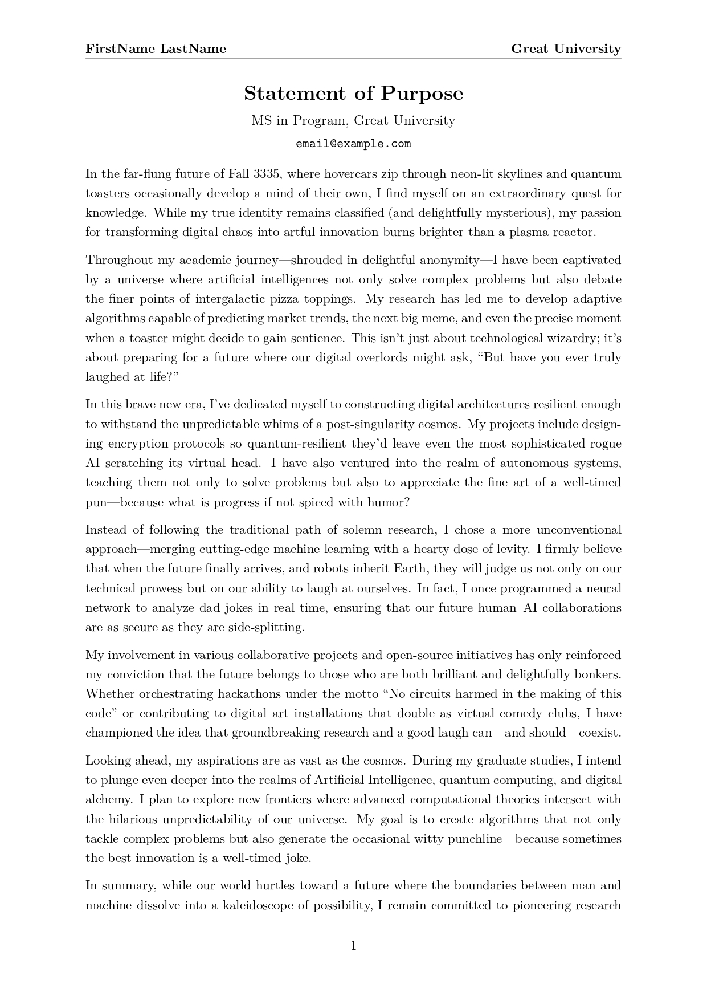
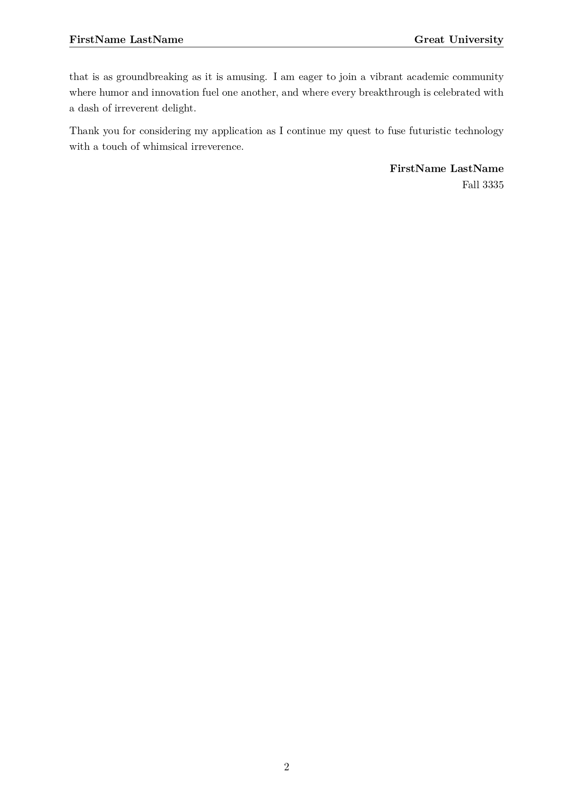

# Statement of Purpose Template

This repository provides a customizable LaTeX template for creating your Statement of Purpose (or Personal Statement) for graduate school applications. The template is designed with a modern, professional look and even a touch of futuristic humor.

## Files

- **main.tex**  
  The main file that sets personal details such as your name, program, university, email, statement title, and term. It then includes the content from `base.tex` and prints the footer.

- **statement.cls**  
  A custom class file that defines the layout, typography, header, footer, and overall style of the document.

- **base.tex**  
  The body of the statement. This file contains the personalized content (in a futuristic and humorous tone) that will appear in your final document.

- **Statement_of_Purpose.pdf**  
  A sample two-page PDF generated using this template.

- **Statement_of_Purpose-1.jpg** and **Statement_of_Purpose-2.jpg**  
  Images of the PDF pages for quick preview.

## How to Use

1. **Customize Your Details:**  
   Open `main.tex` and update the variables:
```latex
   \studentName{FirstName LastName}
   \program{MS in Program}
   \university{Great University}
   \email{email@example.com}
   \statement{Statement of Purpose}
   \term{Fall 3335}
   ```

2. **Edit Content:**  
   Modify `base.tex` to adjust the personal statement content as needed.

3. **Compile the Document:**  
   Compile `main.tex` using your preferred LaTeX editor or an online platform like Overleaf (e.g., run `pdflatex main.tex`) to generate your final PDF.

## Example Output

The template produces a document with:
- A title that shows your statement title, program, university, and email.
- A header on every page displaying your name and university.
- A footer that prints your name and term.

### PDF Preview

Below are previews of the generated Statement of Purpose:

#### Page 1


#### Page 2


## License

Feel free to use and modify this template for your own applications. 
